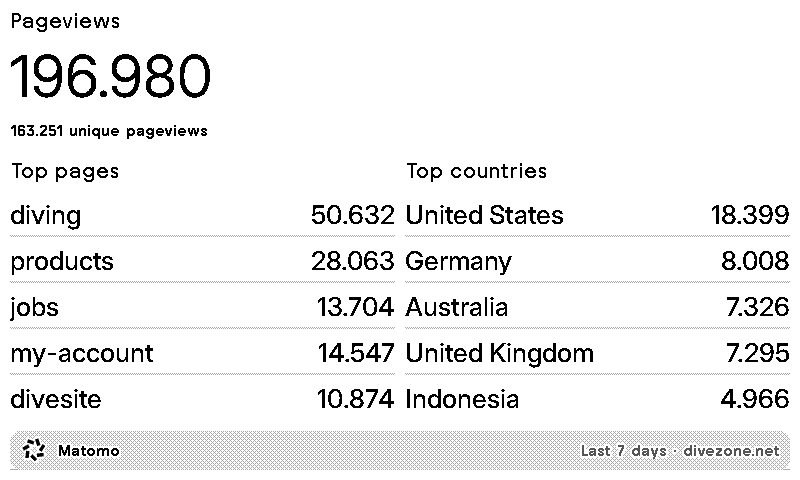

# trmnl-matomo

A [TRMNL](https://usetrmnl.com) plugin that shows [Matomo Analytics](https://matomo.org) on your e-ink display.

Configure your Matomo URL, auth token, and site ID — then pick 2–3 metrics to show. Zero backend required: TRMNL polls Matomo's Reporting API directly and renders the four screen layouts via Liquid templates.



> **Unofficial plugin** — not affiliated with, endorsed by, or connected to Matomo or InnoCraft. The Matomo name and logo belong to InnoCraft.
>
> **No data is stored or transmitted to third parties.** TRMNL polls your Matomo instance directly with the credentials you provide. Nothing is sent anywhere else.

## What it shows

Pick from five metrics:

- **Visits & unique visitors** — total visits, unique visitor count, bounce rate
- **Pageviews** — total pageviews, unique pageviews
- **Top pages** — top 5 by hits
- **Top referrers** — top 5 by visits
- **Top countries** — top 5 by visits

Four time ranges:

- Today *(partial)*
- Yesterday *(default — today's numbers are always partial)*
- Last 7 days *(excludes today)*
- Last 30 days *(excludes today)*

## How it works

```
┌────────────┐    polls    ┌──────────────────┐   renders    ┌──────────────┐
│   TRMNL    │ ──────────► │  Matomo API      │ ───────────► │  Liquid      │
│  (polling) │             │  (bulk request)  │              │  templates   │
└────────────┘             └──────────────────┘              └──────┬───────┘
                                                                    │
                                                              ┌─────▼──────┐
                                                              │  e-ink BMP │
                                                              │  on device │
                                                              └────────────┘
```

A single bulk request to Matomo's `API.getBulkRequest` fetches everything in one shot. The templates use `` gates so only the metrics the user picked actually render. No server, no hosting bill.

## Installation

*To be filled in once the plugin is published to the [TRMNL marketplace](https://usetrmnl.com/plugins).*

## Configuration

| Field | Type | Purpose |
|---|---|---|
| `matomo_url` | URL | Base URL of your Matomo install, e.g. `https://analytics.example.com` |
| `token_auth` | Password | Matomo auth token with view access on the target site |
| `site_id` | String | Numeric site ID (find under Administration → Websites → Manage) |
| `date_range` | Select | Today / Yesterday / Last 7 days / Last 30 days |
| `metrics` | Multi-select | Which 2–3 of the 5 metrics to render |

**Getting a Matomo auth token:** Matomo → top-right user menu → Security → Auth tokens → Create new token. A view-only token is enough.

## Developing & testing

This repo is the source of truth for the templates, polling URL, and field definitions. To publish or update the plugin, paste these files into the TRMNL plugin builder.

### Set up the plugin in TRMNL

1. Go to <https://usetrmnl.com/plugins> → **Create new plugin** (Private is fine while iterating; recreate as Public for marketplace submission).
2. **Strategy:** `Polling`.
3. **Form fields:** paste [`form-fields.yml`](form-fields.yml) into the **Form fields** textarea (see the [Configuration](#configuration) section above for what each field does).
4. **Polling URL:** paste the single line from [`polling-url.txt`](polling-url.txt). Method `GET`, no extra headers.
5. **Markup:** paste each `templates/*.liquid` file into its matching layout slot (`full`, `half_horizontal`, `half_vertical`, `quadrant`).
6. Install the plugin on your own account, configure your Matomo credentials, hit **Preview**.

### Test against the public Matomo demo

No Matomo of your own? Use [demo.matomo.cloud](https://demo.matomo.cloud):

- **matomo_url:** `https://demo.matomo.cloud`
- **token_auth:** `anonymous`
- **site_id:** `1`

The demo returns a real-shaped response with thousands of visits, top pages like `diving` and `products`, and referrers like `reddit`. Useful for verifying layouts before pointing at production data.

### Verify the Matomo response shape

Curl the polling URL with substituted values:

```bash
curl -s "https://demo.matomo.cloud/index.php?module=API&method=API.getBulkRequest&format=JSON&token_auth=anonymous&urls\[0\]=method%3DVisitsSummary.get%26idSite%3D1%26period%3Dday%26date%3Dyesterday&urls\[1\]=method%3DActions.get%26idSite%3D1%26period%3Dday%26date%3Dyesterday" | jq
```

You should get a JSON array. See [`sample-response.json`](sample-response.json) for the full 5-element bulk response shape.

## Files

| Path | Purpose |
|---|---|
| [`form-fields.yml`](form-fields.yml) | YAML to paste into the TRMNL plugin builder's **Form fields** textarea |
| [`polling-url.txt`](polling-url.txt) | Single-line polling URL with `{{ }}` substitutions |
| [`templates/full.liquid`](templates/full.liquid) | 800×480 full-screen layout |
| [`templates/half_horizontal.liquid`](templates/half_horizontal.liquid) | 800×240 horizontal half |
| [`templates/half_vertical.liquid`](templates/half_vertical.liquid) | 400×480 vertical half |
| [`templates/quadrant.liquid`](templates/quadrant.liquid) | 400×240 quadrant |
| [`sample-response.json`](sample-response.json) | Example Matomo bulk response — useful as fixture data |

## Notes & caveats

- **Form field access in templates** — TRMNL exposes form values via `trmnl.plugin_settings.custom_fields_values.<keyname>`, not the `{{ keyname }}` shortcut. Each template aliases them at the top with ``.
- **Root-array responses** — Matomo's bulk endpoint returns a JSON array. TRMNL exposes it as `data` (templates use `data[0]`, `data[1]`, …).
- **Unique visitors on ranges** — Matomo disables `nb_uniq_visitors` for `period=range` by default. For the "Last 7 days" / "Last 30 days" options the unique count will be blank unless the Matomo admin sets `enable_processing_unique_visitors_range = 1` in `config.ini.php`. The "Today" / "Yesterday" options always work.
- **Bounce rate format** — Matomo 4+ returns `bounce_rate` as a string with `%` (e.g. `"45%"`). Templates pass it through unchanged.
- **HTTPS only** — TRMNL's polling worker won't talk to plain `http://` endpoints.
- **Token exposure** — the `token_auth` query param is logged in Matomo's access logs. Recommend users create a dedicated view-only token.

## Contributing

PRs welcome. The cycle is: edit a file here → paste it into the TRMNL plugin builder → preview → commit.

## License

[MIT](LICENSE)
